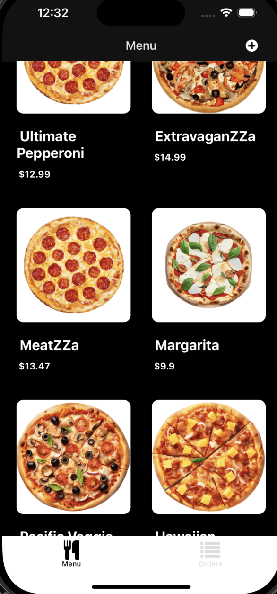

# FoodOrderingApp

FoodOrderingApp is a React Native application for ordering food, built with Expo and Supabase. It supports user and admin roles, allowing users to browse menus, place orders, and manage their cart, while admins can manage products and view orders.



## Features

### User Features

- Browse menu items with images and prices.
- Add items to the cart with size and quantity options.
- View and manage cart items.
- Place orders and view order history.

### Admin Features

- Create, update, and delete menu items.
- View and manage orders.
- Update order statuses.

## Tech Stack

- **React Native**: For building the mobile application.
- **Expo**: For development and deployment.
- **Supabase**: For backend services, including authentication and database.
- **TypeScript**: For type safety.

## Installation

1. Clone the repository:

   ```bash
   git clone https://github.com/Zoro-chi/FoodOrderingApp.git
   cd FoodOrderingApp
   ```

2. Install dependencies:

   ```bash
   npm install
   # or
   yarn install
   ```

3. Set up environment variables:

   - Create a `.env` file in the root directory.
   - Add the following variables:
     ```env
     SUPABASE_URL=<your-supabase-url>
     SUPABASE_ANON_KEY=<your-supabase-anon-key>
     ```

4. Start the development server:
   ```bash
   npm start
   # or
   yarn start
   ```

## Folder Structure

```
FoodOrderingApp/
├── src/
│   ├── app/                # Application screens and layouts
│   ├── components/         # Reusable UI components
│   ├── constants/          # Constants like colors
│   ├── lib/                # Libraries and utilities (e.g., Supabase client)
│   ├── providers/          # Context providers (e.g., Auth, Cart)
│   ├── types/              # TypeScript type definitions
├── assets/                 # Static assets like images and fonts
├── .env                    # Environment variables
├── app.config.ts           # Expo app configuration
├── package.json            # Project dependencies and scripts
├── tsconfig.json           # TypeScript configuration
└── README.md               # Project documentation
```

## Scripts

- `npm start`: Start the development server.
- `npm android`: Run the app on an Android emulator or device.
- `npm ios`: Run the app on an iOS simulator or device.
- `npm web`: Run the app in a web browser.

## Environment Variables

The app uses the following environment variables:

- `SUPABASE_URL`: The URL of your Supabase instance.
- `SUPABASE_ANON_KEY`: The anonymous key for your Supabase instance.

**NOTE**: To run the Stripe Payment server: 
```sh
npx supabase functions serve --env-file .env payment-sheet
```